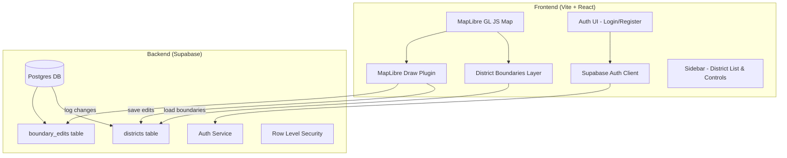

# CTX District Map — Web Map Application

A web application to display and edit Austin-area district boundaries on an interactive map, with Supabase for auth & storage, deployed on Netlify.

## User Review Required

> [!IMPORTANT]
> **Supabase Credentials Needed**: Please provide your Supabase project URL and anon key so we can wire them up. After deployment, these must be set as environment variables in Netlify.

> [!NOTE]
> **Map Tiles**: Using **MapLibre GL JS** with free **OpenStreetMap** tiles — no API key or token renewal needed.

> [!WARNING]
> **District Boundaries**: I will create approximate GeoJSON polygon boundaries for the 16 districts using your organization's exact names (Crystal Falls, Round Rock, Cedar Park, Pflugerville, Lakeline, Wells Branch, Walnut Creek, Hyde Park, Dellwood, Downtown, South Mopac, Live Oak, Brodie, Searight, Hill Country, Del Valle). These are rough geographic approximations — authorized editors can refine them to exact shapes through the app.

---

## Architecture Overview



## Tech Stack

| Layer | Technology |
|-------|-----------|
| Framework | Vite + React 18 |
| Map | MapLibre GL JS (free, no token needed) |
| Drawing | @mapbox/mapbox-gl-draw (compatible with MapLibre) |
| Auth & DB | Supabase (existing project — Postgres + Auth + RLS) |
| Styling | Vanilla CSS (dark theme, glassmorphism) |
| Deploy | Netlify (`ctx-district-map.netlify.app`) |

---

## Proposed Changes

### Project Scaffold

#### [NEW] [package.json](file:///e:/github/sgi_austin_district_border_map/package.json)
Vite + React project with dependencies:
- `react`, `react-dom`
- `maplibre-gl`
- `@mapbox/mapbox-gl-draw`
- `@supabase/supabase-js`

#### [NEW] [vite.config.js](file:///e:/github/sgi_austin_district_border_map/vite.config.js)
Standard Vite React config.

#### [NEW] [netlify.toml](file:///e:/github/sgi_austin_district_border_map/netlify.toml)
Build command, publish dir, SPA redirect rules.

#### [NEW] [.env.example](file:///e:/github/sgi_austin_district_border_map/.env.example)
Template for `VITE_SUPABASE_URL` and `VITE_SUPABASE_PUBLISHABLE_KEY`.

---

### Supabase Schema

#### [NEW] [supabase/schema.sql](file:///e:/github/sgi_austin_district_border_map/supabase/schema.sql)
SQL migration to create:

1. **`districts`** table — stores each district's name, GeoJSON geometry, color, and metadata.
2. **`boundary_edits`** table — audit log of every edit (who, when, old geometry, new geometry).
3. **Row Level Security** — anyone can read, only authenticated users with `editor` role can update.
4. **`user_roles`** table — maps user IDs to roles (`viewer`, `editor`, `admin`).

---

### GeoJSON Data

#### [NEW] [src/data/districts.geojson](file:///e:/github/sgi_austin_district_border_map/src/data/districts.geojson)
Approximate GeoJSON FeatureCollection with 16 polygons using your organization's exact district names. Each feature has `name` and `id` properties. This data seeds the Supabase DB and serves as the initial fallback.

---

### Core Application

#### [NEW] [index.html](file:///e:/github/sgi_austin_district_border_map/index.html)
Root HTML with meta tags, SEO titles, and React mount point.

#### [NEW] [src/main.jsx](file:///e:/github/sgi_austin_district_border_map/src/main.jsx)
React entry point.

#### [NEW] [src/App.jsx](file:///e:/github/sgi_austin_district_border_map/src/App.jsx)
Main app component: manages auth state, renders Map + Sidebar.

#### [NEW] [src/App.css](file:///e:/github/sgi_austin_district_border_map/src/App.css)
Global styles: dark theme, glassmorphism panels, typography (Inter font), animations.

---

### Map Components

#### [NEW] [src/components/MapView.jsx](file:///e:/github/sgi_austin_district_border_map/src/components/MapView.jsx)
- Initializes MapLibre GL with OSM tiles centered on Austin (~30.3°N, -97.7°W)
- Loads district boundaries as a GeoJSON source
- Renders yellow (`#FFD700`) polygon outlines with 2-3px stroke
- Adds district name labels at polygon centroids
- Conditionally enables Draw mode for editors

#### [NEW] [src/components/DrawControls.jsx](file:///e:/github/sgi_austin_district_border_map/src/components/DrawControls.jsx)
- Wraps `@mapbox/mapbox-gl-draw` plugin
- Allows selecting and editing district polygons
- On save: writes updated geometry to Supabase `districts` table, logs diff to `boundary_edits`

---

### Sidebar & UI Components

#### [NEW] [src/components/Sidebar.jsx](file:///e:/github/sgi_austin_district_border_map/src/components/Sidebar.jsx)
- App title and branding
- List of districts (click to fly-to on map)
- Edit history panel (recent boundary changes)
- Login/logout controls

#### [NEW] [src/components/AuthModal.jsx](file:///e:/github/sgi_austin_district_border_map/src/components/AuthModal.jsx)
- Email/password login and registration form
- Uses Supabase Auth
- Shows user role status after login

---

### Supabase Integration

#### [NEW] [src/lib/supabase.js](file:///e:/github/sgi_austin_district_border_map/src/lib/supabase.js)
Supabase client initialization with env variables.

#### [NEW] [src/lib/districts.js](file:///e:/github/sgi_austin_district_border_map/src/lib/districts.js)
Functions to:
- `fetchDistricts()` — load all districts from Supabase (fallback to local GeoJSON)
- `updateDistrictBoundary(id, newGeometry, userId)` — update geometry + log edit
- `fetchEditHistory(districtId)` — get audit trail

#### [NEW] [src/lib/auth.js](file:///e:/github/sgi_austin_district_border_map/src/lib/auth.js)
Functions for login, register, logout, get current user, get user role.

---

## Verification Plan

### Automated Tests
Since this is a new greenfield project with no existing tests:

1. **Build verification**:
   ```bash
   npm run build
   ```
   Confirms the production bundle compiles without errors.

2. **Lint check** (if ESLint configured):
   ```bash
   npx eslint src/
   ```

### Browser Verification
I will use the browser tool to:
1. Open `http://localhost:5173` (Vite dev server)
2. Verify the map renders with district boundaries in yellow
3. Verify district name labels appear
4. Verify the sidebar renders with district list
5. Verify the login modal opens
6. Take screenshots for the walkthrough

### Manual Verification (requires your Supabase credentials)
After you set up Supabase and provide credentials:
1. Run `npm run dev` and open the app
2. Register a new user, then manually set their role to `editor` in Supabase dashboard
3. Log in as editor → verify Draw tools appear on map
4. Edit a district boundary → verify it saves to `districts` table
5. Check `boundary_edits` table for audit log entry
6. Deploy to Netlify → verify `ctx-district-map.netlify.app` loads correctly
